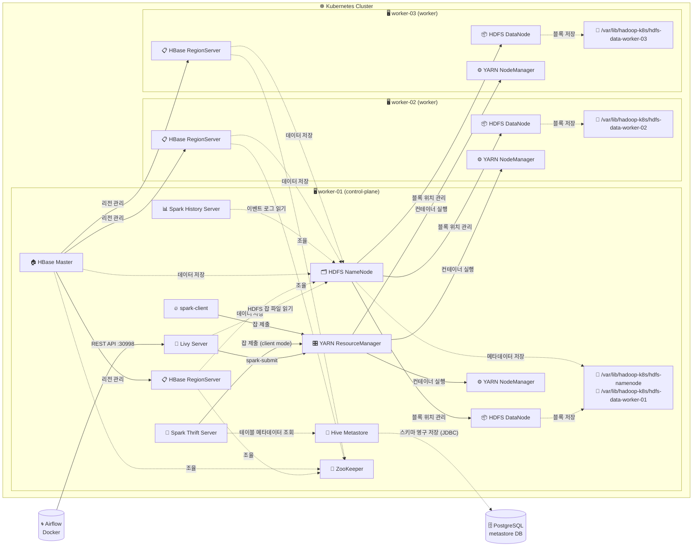

# 🏗️ 아키텍처

[← README로 돌아가기](../README.md)

## 📐 전체 구성도



## 🧩 컴포넌트 역할

### 🗂️ HDFS (Hadoop Distributed File System)

| 컴포넌트     | 역할                                                        | 배치 노드                                |
| ------------ | ----------------------------------------------------------- | ---------------------------------------- |
| **NameNode** | 파일시스템 메타데이터 관리 (어떤 파일이 어느 블록에 있는지) | worker-01 (고정)                         |
| **DataNode** | 실제 파일 블록 데이터 저장                                  | worker-01, worker-02, worker-03 (각 1개) |

### 🔄 YARN (Yet Another Resource Negotiator)

| 컴포넌트            | 역할                                   | 배치 노드                                |
| ------------------- | -------------------------------------- | ---------------------------------------- |
| **ResourceManager** | 클러스터 전체 자원 스케줄링 및 잡 관리 | worker-01 (고정)                         |
| **NodeManager**     | 각 노드의 컨테이너 실행 및 자원 보고   | worker-01, worker-02, worker-03 (각 1개) |

### 🔥 Spark

| 컴포넌트                 | 역할                                              | 배치 노드 |
| ------------------------ | ------------------------------------------------- | --------- |
| **spark-client**         | `spark-submit` 실행 전용 Pod                      | worker-01 |
| **Spark Thrift Server**  | JDBC/ODBC 서버 (HiveServer2 호환), DBeaver 연결용 | worker-01 |
| **Spark History Server** | 완료된 Spark 잡 이력 Web UI                       | worker-01 |

### 🐝 Hive

| 컴포넌트                | 역할                                                        | 배치 노드          |
| ----------------------- | ----------------------------------------------------------- | ------------------ |
| **Hive Metastore**      | 테이블 스키마·위치 영구 저장 (thrift://hive-metastore:9083) | worker-01          |
| **PostgreSQL** (Docker) | Metastore 백엔드 DB (`metastore` 데이터베이스)              | worker-01 (Docker) |

### 🦁 ZooKeeper + HBase

| 컴포넌트               | 역할                                             | 배치 노드                                |
| ---------------------- | ------------------------------------------------ | ---------------------------------------- |
| **ZooKeeper**          | HBase 분산 조율 (마스터 선출, RS 등록)           | worker-01                                |
| **HBase Master**       | 리전 관리, 메타테이블(`hbase:meta`) 관리, Web UI | worker-01                                |
| **HBase RegionServer** | 실제 Row 데이터 저장 및 서빙                     | worker-01, worker-02, worker-03 (각 1개) |

### 🌉 Apache Livy

| 컴포넌트        | 역할                                             | 배치 노드 |
| --------------- | ------------------------------------------------ | --------- |
| **Livy Server** | REST API로 Spark 잡 제출 (Airflow → YARN 브릿지) | worker-01 |

## 💾 스토리지 구조

### PV/PVC 계층

```
Kubernetes PVC
    └── Kubernetes PV (local 타입)
            └── 호스트 디렉터리 (물리 디스크)
```

### 전체 스토리지 맵

| PVC 이름                      | PV 이름                      | 호스트 경로                                         | 크기  | 용도                 |
| ----------------------------- | ---------------------------- | --------------------------------------------------- | ----- | -------------------- |
| `hdfs-namenode-pvc`           | `hdfs-namenode-pv`           | `worker-01:/var/lib/hadoop-k8s/hdfs-namenode`       | 20Gi  | NameNode 메타데이터  |
| `hdfs-datanode-pvc-worker-01` | `hdfs-datanode-pv-worker-01` | `worker-01:/var/lib/hadoop-k8s/hdfs-data-worker-01` | 500Gi | DataNode 블록 데이터 |
| `hdfs-datanode-pvc-worker-02` | `hdfs-datanode-pv-worker-02` | `worker-02:/var/lib/hadoop-k8s/hdfs-data-worker-02` | 500Gi | DataNode 블록 데이터 |
| `hdfs-datanode-pvc-worker-03` | `hdfs-datanode-pv-worker-03` | `worker-03:/var/lib/hadoop-k8s/hdfs-data-worker-03` | 500Gi | DataNode 블록 데이터 |

### NameNode 메타데이터 구조

```text
/var/lib/hadoop-k8s/hdfs-namenode/
└── current/
    ├── fsimage_*          # 파일시스템 스냅샷 (체크포인트)
    ├── fsimage_*.md5      # 무결성 검증용 MD5 해시
    ├── edits_*            # 완료된 트랜잭션 로그
    ├── edits_inprogress_* # 현재 진행 중인 트랜잭션 로그
    ├── seen_txid          # 마지막 처리 트랜잭션 ID
    └── VERSION            # clusterID, namespaceID 등
```

### DataNode 블록 데이터 구조

```text
/var/lib/hadoop-k8s/hdfs-data-worker-01/
└── current/
    └── BP-<blockpool-id>/        # Block Pool (clusterID와 연계)
        └── current/
            └── finalized/
                └── subdir0/subdir0/
                    ├── blk_1073741825       # 실제 파일 블록 (원본 데이터)
                    └── blk_1073741825_1001.meta  # 블록 메타데이터 (체크섬)
```

## 🔗 컴포넌트 간 통신 포트

```text
클라이언트/AM
    │
    ├──→ NameNode :8020  (HDFS RPC - 파일 읽기/쓰기)
    ├──→ NameNode :9870  (Web UI)
    │
    ├──→ ResourceManager :8032  (YARN RPC - 잡 제출)
    ├──→ ResourceManager :8030  (Scheduler - AM ↔ RM 통신, 필수!)
    └──→ ResourceManager :8090  (Web UI)

NameNode
    └──→ DataNode :9866  (블록 데이터 전송)

NodeManager
    ├──→ ResourceManager :8031  (자원 현황 보고)
    └──→ ResourceManager :8033  (Admin)

ApplicationMaster (AM)
    └──→ NodeManager :8040  (컨테이너 실행 요청)
    └──→ NodeManager :8041  (NM RPC)
    └──→ NodeManager :8042  (NM Web UI)
```

## 🌐 외부 접속 (NodePort)

| 서비스                      | 내부 포트 | NodePort               | 접속 URL                                        |
| --------------------------- | --------- | ---------------------- | ----------------------------------------------- |
| HDFS Web UI                 | 9870      | **30870**              | http://YOUR_NODE_IP:30870                       |
| YARN Web UI                 | 8090      | **30890**              | http://YOUR_NODE_IP:30890                       |
| Spark Thrift Server (JDBC)  | 10000     | **30100**              | `jdbc:hive2://YOUR_NODE_IP:30100/default`       |
| Spark History Server        | 18080     | **30180**              | http://YOUR_NODE_IP:30180                       |
| PostgreSQL (Docker, Hive용) | 5432      | 5432                   | `jdbc:postgresql://YOUR_NODE_IP:5432/metastore` |
| HBase Master UI             | 16010     | **30610**              | http://YOUR_NODE_IP:30610                       |
| Livy REST API               | 8998      | **30998**              | http://YOUR_NODE_IP:30998                       |
| ZooKeeper                   | 2181      | - (클러스터 내부 전용) | `zookeeper:2181`                                |

## 🔄 재시작 시 복구 흐름

```
1. NameNode 시작
   └── /data/namenode/current 존재 여부 확인
       ├── 없음 → hdfs namenode -format (최초 1회)
       └── 있음 → fsimage 로드 → edits 재생 → 서비스 시작

2. DataNode 시작
   └── /data/hdfs/current/VERSION의 clusterID 확인
       ├── NameNode clusterID와 일치 → 정상 등록
       └── 불일치 → 등록 거부 (데이터 초기화 필요)

3. NodeManager 시작
   └── Pod IP를 /etc/hosts에 등록
       └── yarn-site.xml에 Pod IP 주입
           └── ResourceManager에 등록

4. Spark Thrift Server 시작
   └── spark-submit --master yarn --deploy-mode client 실행
       └── YARN AM(Driver) 기동 → Executor × 2 할당
           └── HiveThriftServer2 포트 10000 바인딩

5. Hive Metastore 시작
   └── initContainer: PostgreSQL JDBC 드라이버 다운로드
       └── schematool -initSchema (최초 1회)
           └── thrift://hive-metastore:9083 바인딩

6. ZooKeeper 시작
   └── standalone 모드 (단일 노드)
       └── 포트 2181 바인딩

7. HBase Master 시작
   └── Pod hostname = 'hbase-master' (고정)
       └── ZooKeeper에 active master 등록
           └── HDFS /hbase 에 시스템 테이블 초기화
               └── RegionServer 등록 대기

8. HBase RegionServer 시작
   └── Pod IP를 hostname으로 ZooKeeper에 등록
       └── HBase Master와 연결
           └── 리전 서빙 시작

9. Livy Server 시작
   └── initContainer: /var/lib/hadoop-k8s/livy-cache에 Livy 바이너리 캐시 확인
       ├── 없음 → Apache 미러에서 다운로드 (최초 1회)
       └── 있음 → 바로 사용
           └── 포트 8998 바인딩 → REST API 준비
```
